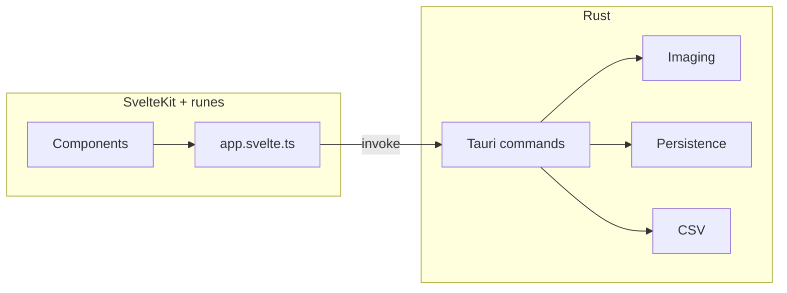

# Safari Client — Rewrite Plan (as-built + LLM guide)

This file was originally a **forward-looking** plan. It is now **aligned with the repository as implemented**. If you are an LLM asked to “execute the plan again,” **do not** recreate the obsolete details in the old “File Structure” / “Rust Commands” sections verbatim—use **§Ground truth** instead.

---

## LLM pitfalls (read first)

1. **Package manager:** The repo uses **`npm`** and **`package-lock.json`**, not pnpm. CI runs `npm ci`. Do not introduce pnpm-only scripts without migrating the lockfile.
2. **State layout:** There is **no** `src/lib/stores/{slides,selection,filter,species}.svelte.ts` split. State lives mainly in **`src/lib/app.svelte.ts`** (`slides`, `selectedIds`, `ui`, `speciesList`, etc.) plus small helpers (`theme.ts`, `i18n.ts`).
3. **SvelteKit:** The app uses **`src/routes/+layout.svelte`**, **`src/routes/+page.svelte`**, not a root `App.svelte` as the only entry (adapter-static).
4. **Command names:** Tauri commands are suffixed **`_cmd`** in Rust and invoked as e.g. `invoke("load_slides_from_paths_cmd", …)`. There is no `load_images` / `check_previews` as originally sketched—see **§Rust commands (actual)**.
5. **Thumbnails:** New slides are registered with **`image::image_dimensions`** (fast); preview files are written **asynchronously** from the frontend via **`regenerate_thumbnails_cmd`** and **`drainThumbnailQueue()`**. Do not block the UI generating all thumbs inside `load_slides_from_paths`.
6. **Svelte 5 cross-module reactivity:** Mutating `slides[i]` from `app.svelte.ts` may **not** invalidate `$derived(app.visibleSlides())` in `+page.svelte`. The codebase uses **`slidesRenderEpoch.n`** (`$state({ n: 0 })`) bumped after thumbnail completion and other mutations, and **`$derived.by(() => { void app.slidesRenderEpoch.n; … })`** for `visible`, `counts`, `speciesUsage`. **Replacing slide objects with `slides.splice` + bumping epoch** is required for grid thumbnail refresh.
7. **`thumbnailsPending`:** Serialized as camelCase from Rust. **`normalizeSlide()`** treats missing/`undefined` as pending; also accepts **`thumbnails_pending`** if ever present. **`thumbReady === (slide.thumbnailsPending === false)`** in tiles.
8. **Playwright:** Not in `package.json`. Phase-8 “optional Playwright” was **not** implemented; CI runs Vitest + Rust tests only.
9. **Config filenames:** **`vite.config.js`** (not `.ts`). **`Makefile`** exists at repo root for common tasks (`make help`).
10. **README / docs:** User-facing copy is **Italian** (PRD); **README** is **English** by project convention.

---

## Ground truth — stack

| Area | Actual choice |
|------|----------------|
| Shell | Tauri **v2** |
| Frontend | **SvelteKit** + **Svelte 5** runes + TypeScript + Vite |
| Styling | **Tailwind CSS v4** (`@import "tailwindcss"` in `app.css`, `@custom-variant dark` for class-based theme) |
| State | `$state` / `$derived` in **`app.svelte.ts`**; theme in **`ui.theme`** + `theme.ts` (`applyDocumentTheme`) |
| Images | Rust `image` crate; previews under system temp → **`safari-client-previews`** |
| Persistence | `save_app_state_cmd` / `restore_slides_cmd`; JSON under `SafariClient/state.json` (see README) |
| CSV | `export_csv_cmd` — validation + write in Rust |
| DnD | `svelte-dnd-action` on **All** tab only |
| Package manager | **npm** |
| Icons | `src-tauri/icons/*` (`icon.icns`, PNG sizes, `icon.ico`) |

---

## Rust commands (actual)

Registered in `src-tauri/src/lib.rs` (names as invoked from TS):

| Invoke name | Role |
|-------------|------|
| `load_species_catalog_cmd` | Load bundled species CSV |
| `save_app_state_cmd` | Persist `AppState` |
| `load_app_state_cmd` | Load raw JSON state |
| `restore_slides_cmd` | Load persisted slides + build `SlideDto` list with `ensure_previews_for_persisted` (dimensions only; `thumbnails_pending` if cache files missing) |
| `load_slides_from_paths_cmd` | **Lazy** slides: dimensions + paths, `thumbnails_pending: true` |
| `regenerate_thumbnails_cmd` | Write 350/512/1024 previews for one file + transform |
| `remove_slide_cache_cmd` | Delete cached previews for a basename |
| `apply_transform_action_cmd` | D4 user action → next `transform_id` |
| `export_csv_cmd` | Validate + write CSV |

**Not present:** separate `check_previews` / `load_images` commands as in the old sketch.

---

## Frontend state (actual)

- **`src/lib/app.svelte.ts`:** `slides`, `slidesRenderEpoch`, `ui` (`filterTab`, `theme`), `speciesList`, `selectedIds`; helpers `initApp`, `addImagesFromPaths`, `drainThumbnailQueue`, transforms, filters, `normalizeSlide`, etc.
- **Selection** is `selectedIds: string[]` (ids = basenames), not a `Set` in a separate file.
- **Species modal** builds synthetic “remove species” row in **`SpeciesModal.svelte`**, not a separate store file.

---

## Key types (actual)

`Slide` uses **`id`** and **`path`** (full path string), not `filename` + `originalPath`. Persistence uses **`PersistedSlide`** without thumbnail paths. See **`src/lib/types.ts`**.

---

## Imaging pipeline (actual)

1. **`load_slides_from_paths`** → `slide_dto_lazy_from_path`: `image::image_dimensions` + expected thumb paths, **`thumbnails_pending: true`**.
2. **`ensure_previews_for_persisted`:** If all three cache files exist → `thumbnails_pending: false`; else pending true; **no** synchronous full decode for restore.
3. **Frontend `drainThumbnailQueue`:** Batches `regenerate_thumbnails_cmd`, then **`slides.splice(idx, 1, nextSlide)`** + **`bumpSlidesRenderEpoch()`**.

---

## UI features beyond original plan sketch

- **Theme:** light / dark / system (`ui.theme`, `initTheme` in layout, `localStorage`).
- **Load progress overlay** when importing many files.
- **Lightbox:** original file via `convertFileSrc`, keyboard nav, wheel/pinch zoom, pan when zoomed, species + category + selection sidebar, fit vs 100%.
- **Grid zoom** slider (min cell width, `localStorage`).
- **Wheel:** `nonPassiveWheel` action so zoom `preventDefault` works.
- **Species label** on tiles when assigned; filenames de-emphasized / removed from grid per UX iteration.

---

## File structure (approximate — verify with tree)

Key paths:

- `src/routes/+page.svelte`, `+layout.svelte`, `app.html`
- `src/lib/app.svelte.ts`, `src/lib/types.ts`, `src/lib/theme.ts`
- `src/lib/components/*.svelte` (NavBar, TabBar, SlideGrid, SlideTile, Lightbox, …)
- `src/lib/utils/transform.ts`, `transform.test.ts`, `i18n.ts`
- `src/lib/actions/nonPassiveWheel.ts`
- `src-tauri/src/lib.rs`, `commands/{images,export,persistence,species}.rs`, `imaging/{thumbnails,transform}.rs`, `models/`
- `src-tauri/resources/elenco_pesci_2019.csv`
- `.github/workflows/ci.yml`, `release.yml`
- `Makefile`
- `docs/PRD.md`

There is **no** `vite.config.ts` — use **`vite.config.js`**.

---

## Testing (as-built)

| Layer | What runs |
|-------|-----------|
| Rust | `cargo test`, `cargo clippy -- -D warnings` in `src-tauri/` (CI + Makefile) |
| TS | `src/lib/utils/transform.test.ts` via **Vitest** (`npm test`) |
| E2E | **Not** wired (no Playwright in repo) |

---

## CI/CD (as-built)

**`ci.yml`:** `ubuntu-22.04`, `macos-latest`, `windows-latest`. **npm** (`npm ci`, cache `package-lock.json`). Steps: `npm run check`, `lint`, `npm test`, `cargo clippy`, `cargo test`, `npm run tauri build -- --debug`.

**`release.yml`:** Tag `v*`. Matrix includes **two macOS targets** (`aarch64-apple-darwin`, `x86_64-apple-darwin`), Linux, Windows. Uses **`tauri-apps/tauri-action@v0`** with `args: ${{ matrix.target && format('--target {0}', matrix.target) || '' }}`. Draft release.

**Do not** document pnpm in CI—it is not used.

---

## Makefile

Root **`Makefile`**: `make help`, `make install`, `make dev`, `make quality`, `make verify`, `make tauri-build`, etc. Prefer this for local parity with CI commands.

---

## Architecture (conceptual — still valid)

---

## D4 transform

Unchanged in principle: **`transform_id`** 0–7, shared logic in Rust (`imaging/transform.rs`) and CSS via **`transformIdToCss`** in TS. Thumbnails always regenerated after apply in Rust.

---

## Original phases — what “done” means (retro)

| Phase | Delivered (high level) |
|-------|-------------------------|
| 1 | Tauri + SvelteKit scaffold, models, species load, JSON persistence commands |
| 2 | Lazy load + background thumb gen, D4 in Rust, temp cache dir |
| 3 | NavBar, TabBar, grid, tiles, empty state |
| 4 | Selection, categories, species modal, dnd reorder, debounced save |
| 5 | Lightbox, species overview, CSV export |
| 6 | Italian UI strings, window size, icons, bundler |
| 7 | CI + release workflows (npm, not pnpm) |
| 8 | Rust tests + Vitest transform test; **no** Playwright |

---

## Risks and mitigations (updated)

| Risk | As-built mitigation |
|------|---------------------|
| Large imports blocking UI | Lazy metadata + `drainThumbnailQueue` + progress overlay + `requestAnimationFrame` yields |
| Svelte not updating thumbs | **`slidesRenderEpoch`** + `splice` + `$derived.by` |
| Wrong package manager in automation | Use **npm** everywhere unless repo migrates |
| macOS two-arch releases | Release matrix builds **arm64 + x86_64** separately—not a universal binary unless you add `universal-apple-darwin` |
| Tauri asset scope | `assetProtocol.scope` in `tauri.conf.json` for `convertFileSrc` |

---

## Code signing

Optional; same as before—secrets for Apple/Windows if distributing outside trusted circles. Unchanged by implementation.
